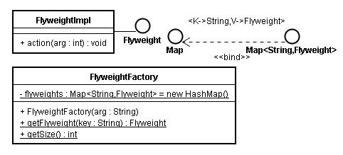

# Flyweight 享元模式

## 概述
运用共享技术有效地支持大量细粒度的对象。

## 适用性
当都具备下列情况时，使用Flyweight模式：
1. 一个应用程序使用了大量的对象
2. 完全由于使用大量的对象，造成很大的存储开销
3. 对象的大多数状态都可变为外部状态
4. 如果删除对象的外部状态，那么可以用相对较少的共享对象取代很多组对象
5. 应用程序不依赖于对象标识。由于Flyweight对象可以被共享，对于概念上明显有别的对象，标识测试将返回真值

## 参与者
1. Flyweight 描述一个接口，通过这个接口flyweight可以接受并作用于外部状态
2. ConcreteFlyweight 实现Flyweight接口，并为内部状态（如果有的话）增加存储空间。
    ConcreteFlyweight对象必须是可共享的。
    它所存储的状态必须是内部的；即，它必须独立于ConcreteFlyweight对象的场景
4. UnsharedConcreteFlyweight 并非所有的Flyweight子类都需要被共享。Flyweight接口使共享成为可能，但它并不强制共享。 在Flyweight对象结构的某些层次，UnsharedConcreteFlyweight对象通常将ConcreteFlyweight对象作为子节点
5. FlyweightFactory 创建并管理flyweight对象。 确保合理地共享flyweight。当用户请求一个flyweight时，FlyweightFactory对象提供一个已创建的实例或者创建一个(如果不存在的话)

## 类图
  

